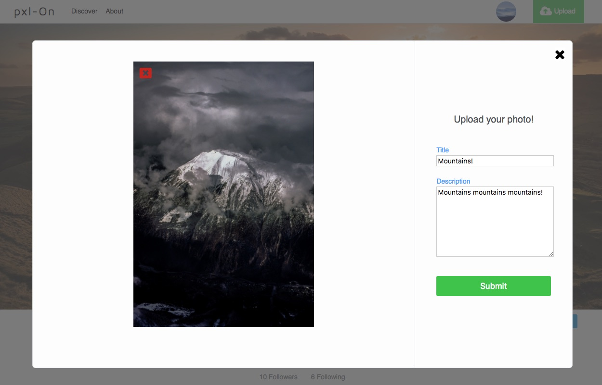
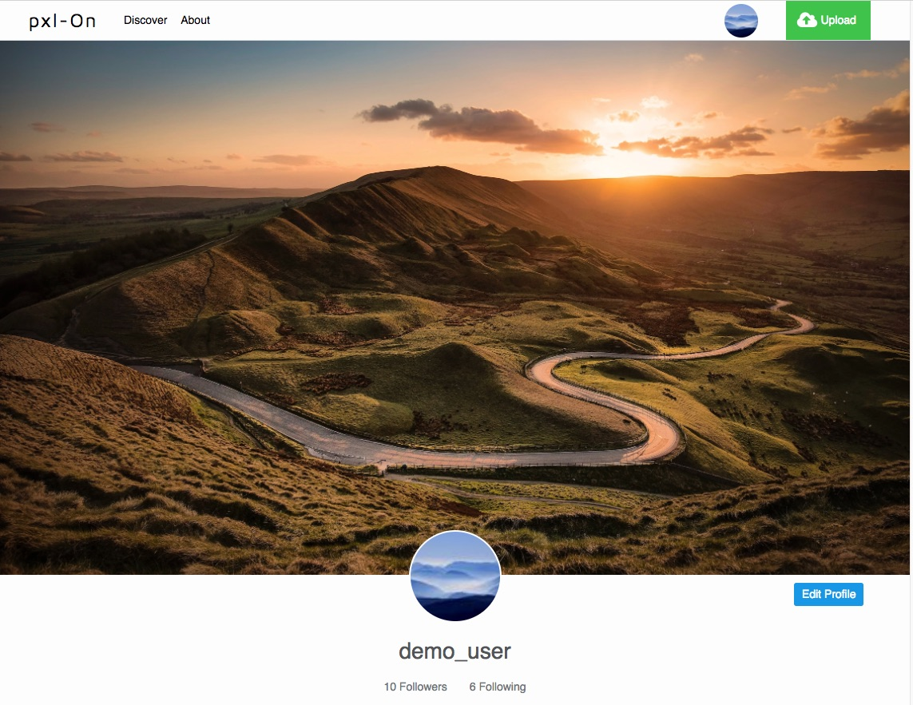

# pxl-On

[pxl-on live site][pxl-On]
[pxl-On]: https://pxl-on.herokuapp.com/

pxl-On is a full-stack single-page app (SPA) inspired by photo sharing sites like 500px
and Instagram. It uses React/Redux on the front end and a Ruby on Rails backend to
serve up a RESTful API.

## Features
- User authentication with demo login
- User photo uploads and CRUD operations
- Amazon AWS S3 storage
- Follow users and feed page
- Discover new photos and users to follow
- Mobile first responsive CSS

### User authentication and Demo Login
Users can try out the site first using the demo login feature.

  
<!--  -->

### Mobile Responsiveness
pxl-On uses mobile first CSS to deliver a seamless experience between computer and mobile screens. The app uses a combination of Flexbox and the new CSS Grid system.

  
<!--  -->

### User uploads
Users can upload photos via the upload modal that is available on every page as well as delete and edit photos on the manage page.

### User profiles, photo feed, and discover
Users can set their own cover photo and profile photo on their profile page. After following other users, a photo feed will be available to keep up to date with new uploads. A discover page allows users to find new photos and users to follow.

### Future Directions
In addition to the already present features, I plan to continue working on this app over time. Database duties are handled by a postgreSql db and Amazon
AWS S3 buckets for photo storage. These are some of the features I plan on implementing:
- Comments and favorites - users can comment on each other's photos and add them to a 'favorites' list.
- Search - allow users to search by username and photo title.
- Backend optimization - optimize SQL queries to reduce database load.
